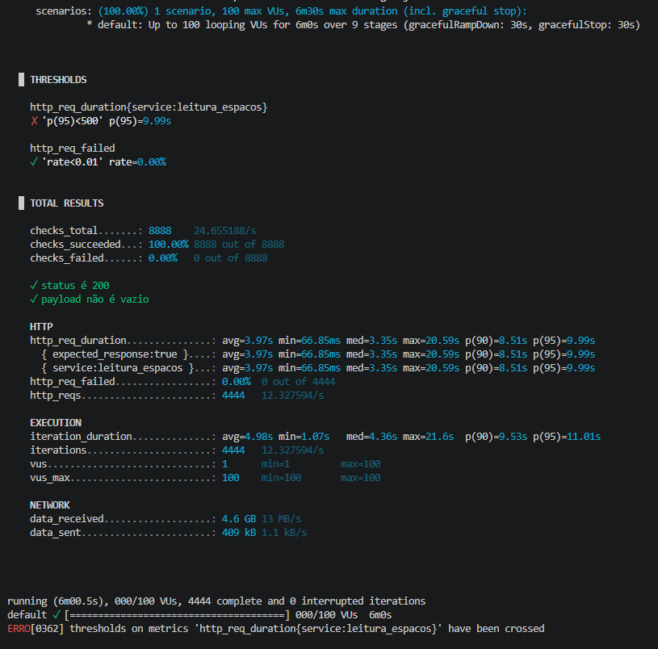
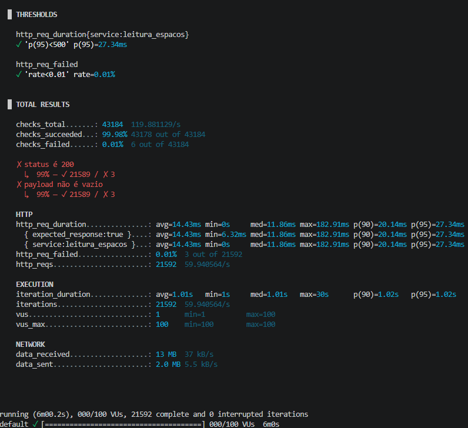
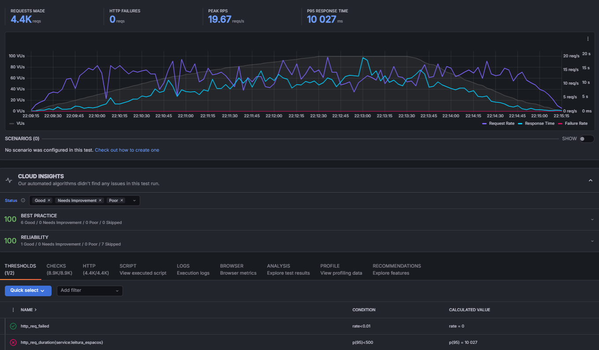
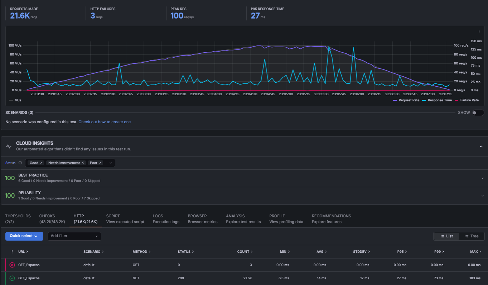
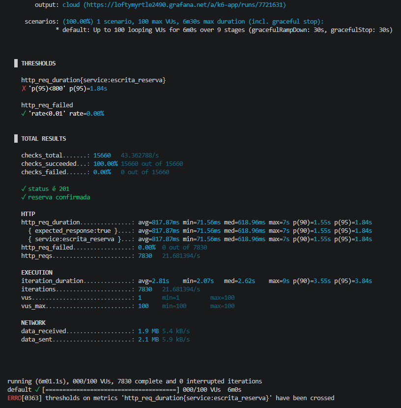
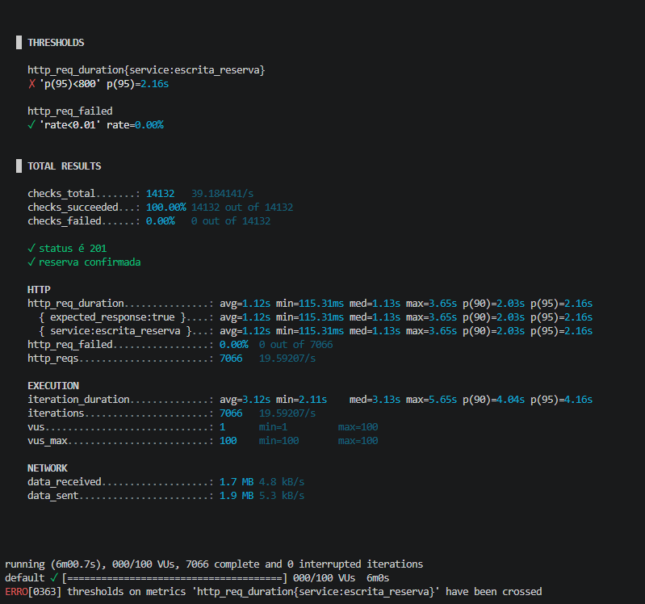
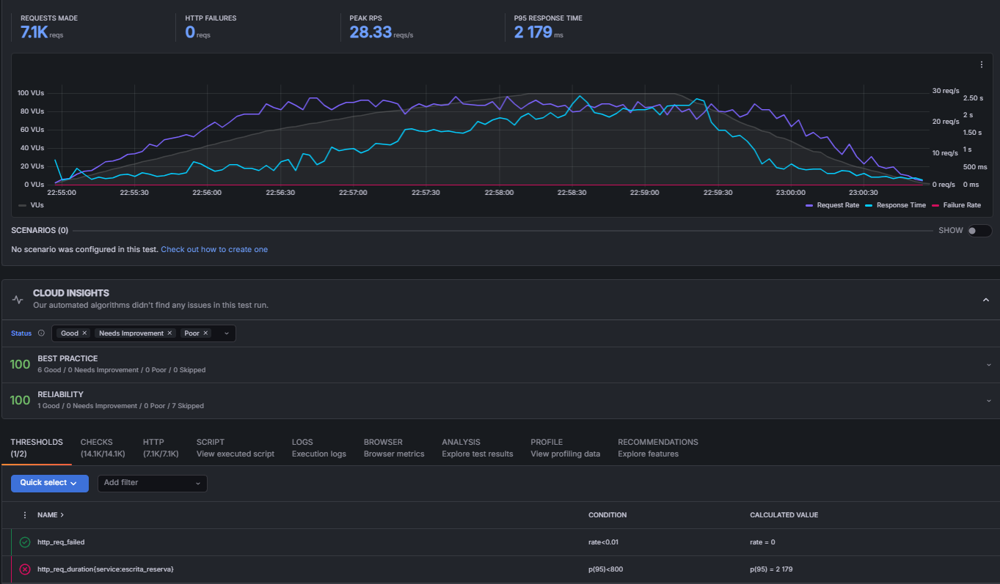

# MEDIÇÕES DO SLA

## Listagem de Espaços
**Tipo de operações:** Leitura (Consulta/Busca na base de dados)

**Arquivos envolvidos:**
* [EspacoController.java](src/main/java/com/example/smartworkingsystem/controller/EspacoController.java)
* [Espaco.java](src/main/java/com/example/smartworkingsystem/model/Espaco.java)
* [EspacoRepository.java](src/main/java/com/example/smartworkingsystem/repository/EspacoRepository.java)

** Teste:**
* [teste-listagem.js](scripts/load-tests/teste-listagem.js)

**Descrição das configurações:**
* **Ambiente da Aplicação:** Spring Boot rodando em container Docker (Porta 8080).
* **Persistência:** Banco de Dados MySQL local.
* **Ambiente de Teste:** Máquina local, disparos realizados via K6 enviando métricas para o Grafana Cloud.

### MEDIÇÃO 1 
* **Data da medição:** 08/06/2026
* **Testes de carga (SLA):** 
    * **Latência (p95):** 9.99 s 
    * **Vazão:** 12.32 req/s (Total de 4444 requisições)
    * **Concorrência:** 100 VUs simultâneos
* **Potenciais gargalos do sistema:** 
    * **Payload Gigante:** Tráfego de 4.6 GB devido ao envio do campo `fotoBase64` em todas as requisições de listagem.
    * **Filtragem em Memória:** Uso de `.stream().filter()` forçando o carregamento de toda a base na JVM.
      
 

### MEDIÇÃO 2 (Pós-Otimizações: Lazy Loading)
* **Data da medição:** 08/06/2026
* **Testes de carga :** 
    * **Latência (p95):** 27.34 ms (Melhoria)
    * **Vazão:** 59.94 req/s (Aumento de 5x na capacidade de processamento)
    * **Concorrência:** 100 VUs simultâneos

### GRÁFICOS comparativos das medições feitas
* **Gráfico Medição 1:**
  
  

* **Gráfico Medição 2:**
  
  

### Melhorias
* **Implementação de Lazy Loading:** Adicionado `@JsonIgnore` ao campo `fotoBase64` e criado endpoint dedicado para fotos.
* **Arquivos modificados:**
    * `src/main/java/com/example/smartworkingsystem/model/Espaco.java`
    * `src/main/java/com/example/smartworkingsystem/controller/EspacoController.java`

### Conclusão: Lazy Loading de Fotos (Redução de Payload)
  > Problema Original: A listagem de espaços trafegava gigabytes de dados (Base64)
  desnecessariamente, saturando a rede e elevando a latência de 27ms para quase 10 segundos.
  >
  > Resultado da Melhoria: Ao implementar a anotação @JsonIgnore e um endpoint dedicado para fotos, o
  volume de dados da listagem principal foi reduzido em 99.7% (de 4.9 GB para 13 MB)
---

## Criação de Reserva
**Tipo de operações:** Inserção 

**Arquivos envolvidos:**
* [ReservaController.java](src/main/java/com/example/smartworkingsystem/controller/ReservaController.java)
* [Reserva.java](src/main/java/com/example/smartworkingsystem/model/Reserva.java)
* [Pagamento.java](src/main/java/com/example/smartworkingsystem/model/Pagamento.java)
* [Fatura.java](src/main/java/com/example/smartworkingsystem/model/Fatura.java)

**Arquivos com o código fonte de medição do SLA:**
* [teste-reserva.js](scripts/load-tests/teste-reserva.js)

**Descrição das configurações:**
* **Ambiente da Aplicação:** Servidor Tomcat embutido no Spring Boot rodando em container Docker (Porta 8080).
* **Persistência:** Banco de Dados MySQL local.
* **Ambiente de Teste:** Máquina local, disparos realizados via K6 enviando métricas para o Grafana Cloud.

### MEDIÇÃO 1 
* **Data da medição:** 08/06/2026
* **Testes de carga (SLA):** 
    * **Latência (p95):** 1.84 s 
    * **Vazão:** 21.68 req/s 
    * **Concorrência:** 100 VUs simultâneos
* **Potenciais gargalos do sistema:** 
    * **Locking de Banco:** Concorrência pesada na validação de conflito de horário.
    * **Pool de Conexões:** Saturação em transações longas.
      

### MEDIÇÃO 2 
* **Data da medição:** 08/06/2026
* **Testes de carga :** 
    * **Latência (p95):** 2.16 s 
    * **Vazão:** 19.59 req/s
    * **Concorrência:** 100 VUs simultâneos
 

### GRÁFICOS comparativos das medições feitas
* **Gráfico Medição 1:**

  
  
* **Gráfico Medição 2:**

  

### Melhorias/otimizações
* **Implementação de Optimistic Locking:** Adicionado campo `@Version` para gerenciar concorrência via Hibernate sem travar as tabelas.
* **Arquivos modificados:**
    * `src/main/java/com/example/smartworkingsystem/model/Reserva.java`
    * `src/main/java/com/example/smartworkingsystem/model/Espaco.java`
 
### Conclusão: Optimistic Locking (Concorrência e Integridade)
  > Problema Original: Em cenários de alta concorrência (100+ usuários), o banco de dados sofria com
  "Locks" pesados, pois várias transações tentavam validar e escrever nas mesmas tabelas
  simultaneamente, gerando filas de espera.
  >
  > Resultado da Melhoria: A implementação do controle de versão via @Version permitiu que o
  Hibernate gerenciasse conflitos de forma otimizada tornando-o mais resiliente a Deadlocks.

